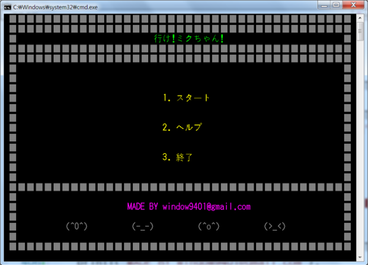
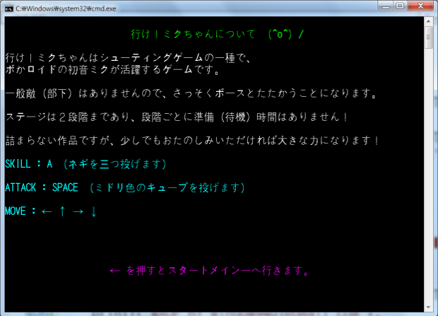
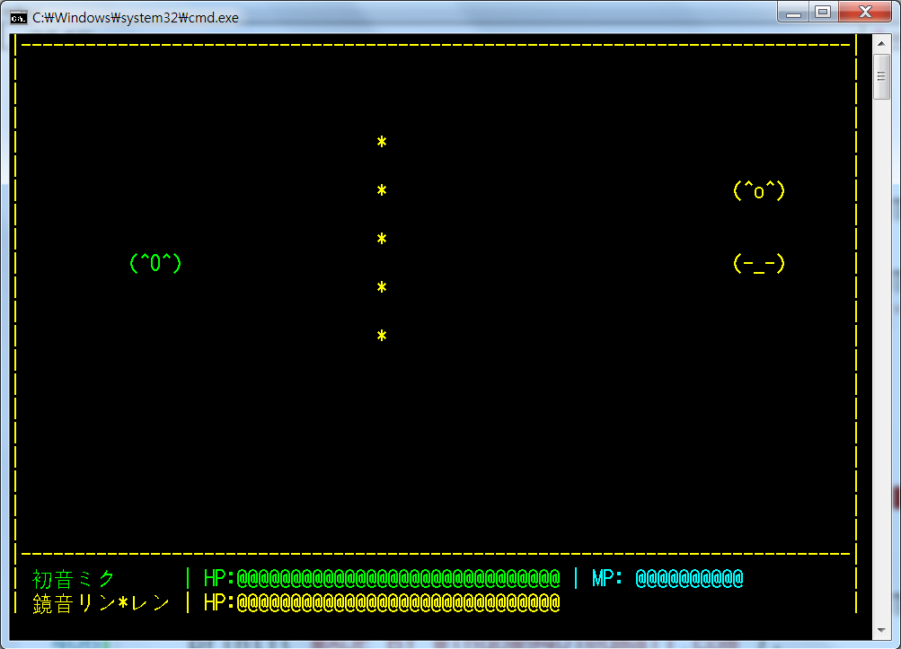
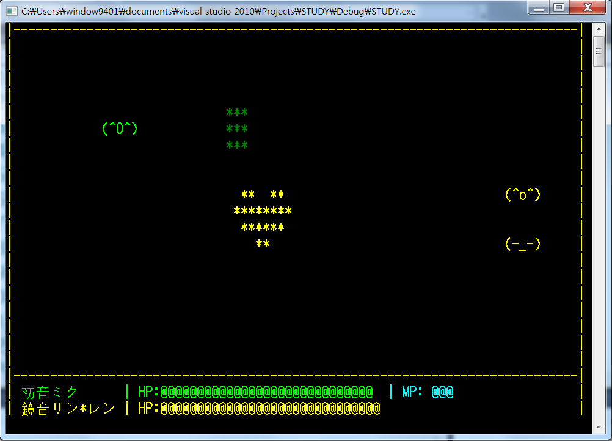
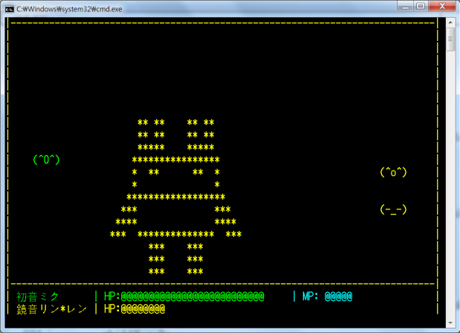
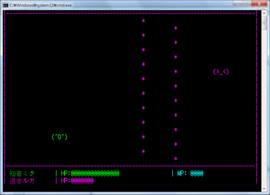
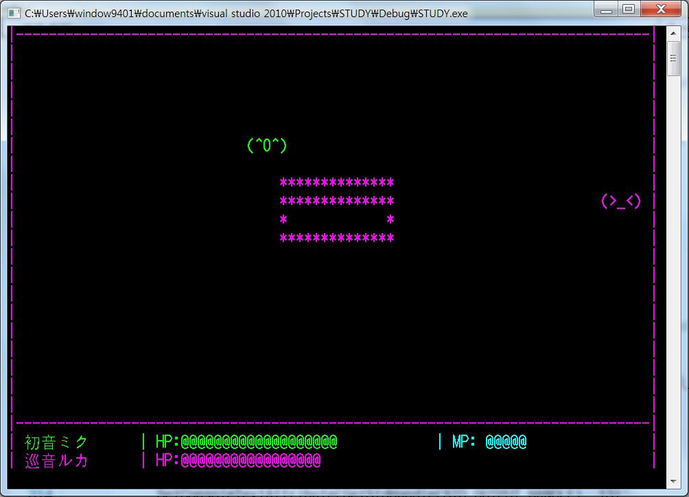

# Go-Miku-Chan
Go-Miku-Chan(Japanese : 行け！ミクちゃん！) is a shooting game about vocaloids.
concept is based on PS game 'Hatsune Miku Project-Diva F 2nd'.

# How to Play
1. Build this project and execute .exe file
2. Press '1' Key for game start (2 is for show how to play written japanese. 3 is exit program)
3. There are two stages. Avoid bullet and Defeat enemies.
4. (Keyboard) Arrows : move, Space : default attack, A : Use skill

# Game Screenshot
### Main & How to Play

### Stage 1

### Stage 2

